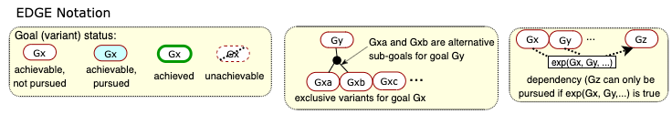

# NIER23
We propose EDGE, an ExtenDed Goal modElling paradigm for self-adaptive (SAS) systems. The EDGE notation - shown below - provides support for the specification of goal variants, properties, status and dependencies, and allows the automated synthesis of \emph{goal controllers} for the goal management layer of SAS.

