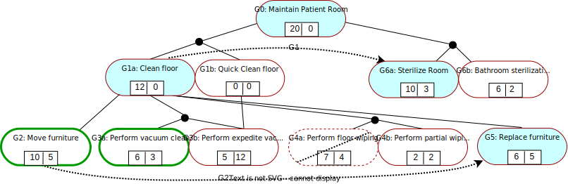

# NIER23
We propose EDGE, an ExtenDed Goal modElling paradigm for self-adaptive (SAS) systems. The EDGE notation - shown below - provides support for the specification of goal variants, properties, status and dependencies, and allows the automated synthesis of goal controllers for the goal management layer of SAS.

We illustrate the use for the EDGE notation below, for a SAS comprising a robot whose top-level goal G0 is to maintain a patient room in a hospital by cleaning its floor in one of two ways (goal variants G1a, G1b, cf.~desideratum D1) and sterilizing the whole room/its bathroom (goal variants G6a, G6b). Cleaning the floor thoroughly (goal variant G1a) requires the moving of some of the room furniture to one side (goal G2), vacuum cleaning (goal variants (G3a), (G3b), wiping the floor (goal variants (G4a), (G4b), and replacing the removed furniture in its initial position (G5).

The Markov decision process derived by applying the method from our ICSE-NIER 2023 submission to this EDGE goal model is included in the [EDGE-CaseStudy folder](EDGE-CaseStudy). We used the probabilistic model checker PRISM to synthesise a goal controller (i.e., a policy for this MDP) that:
    - (requirement 1) maximises the SAS utility 
    - (requirement 2) while keeping the cost no larger than 25. 
    The probabilistic temporal logic formula supplied to PRISM in order to obtain this MDP policy is available here, and the actual policy (in raw PRISM format) is available here, along with the encoding that PRISM used for the MDP states, which we made available here.

