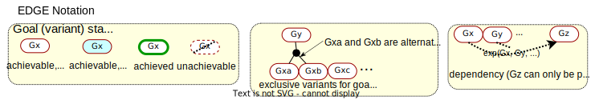
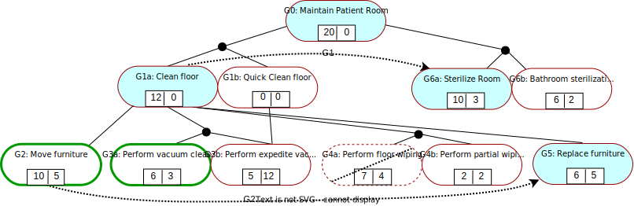
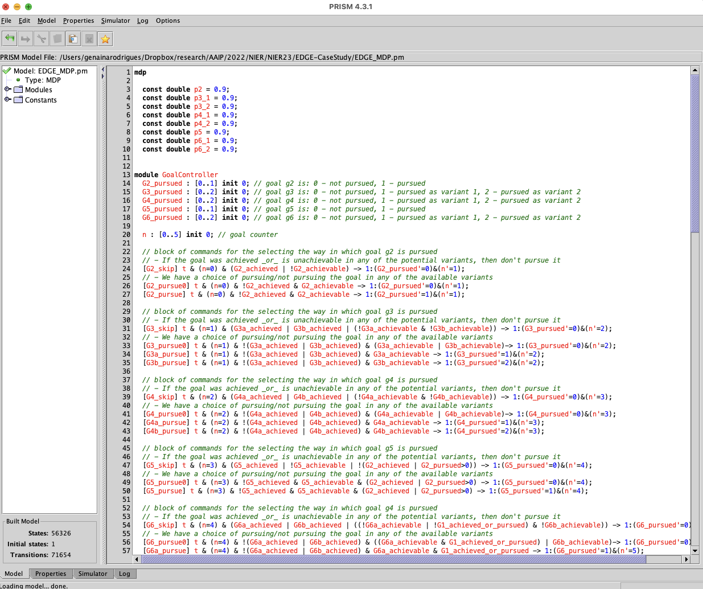
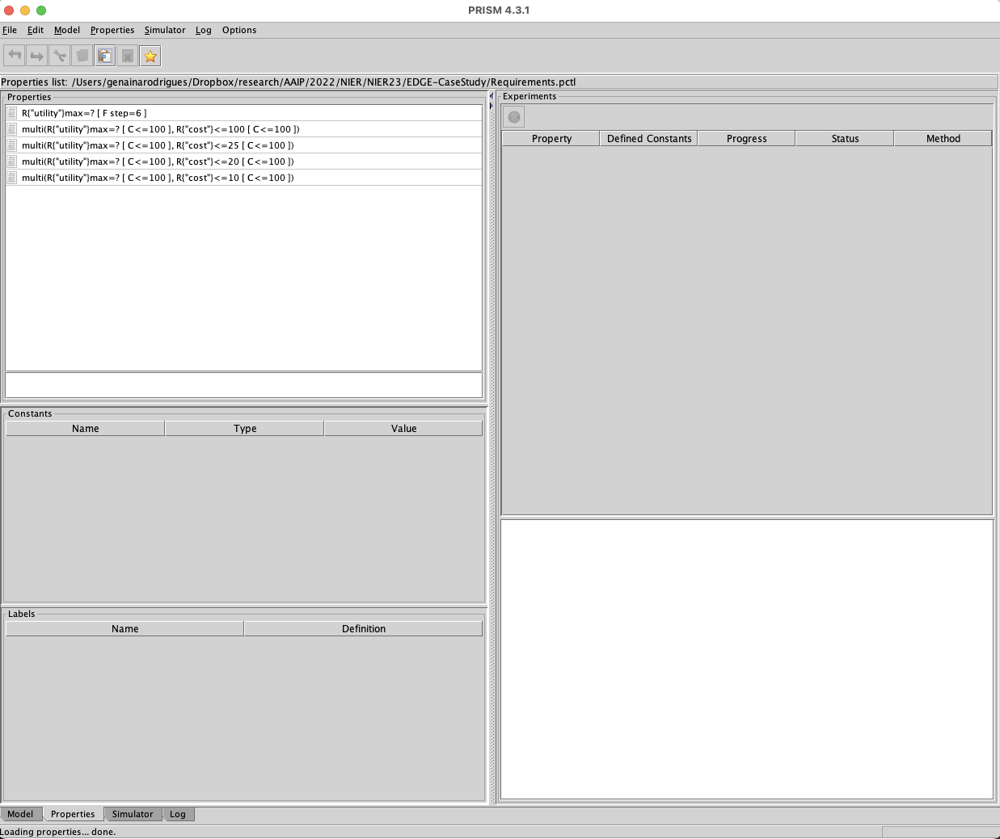
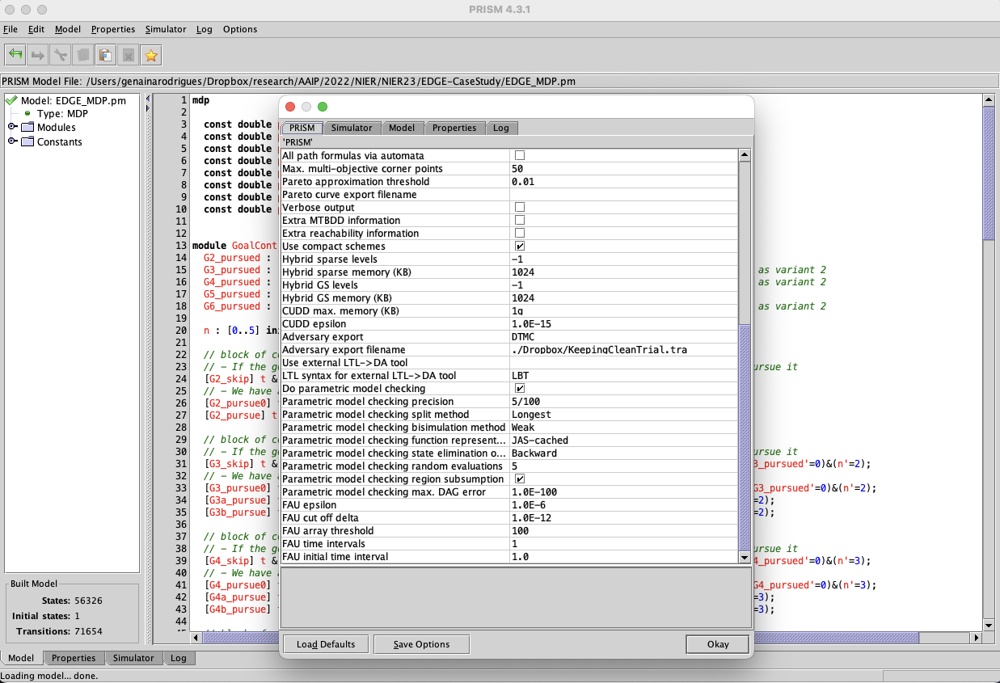
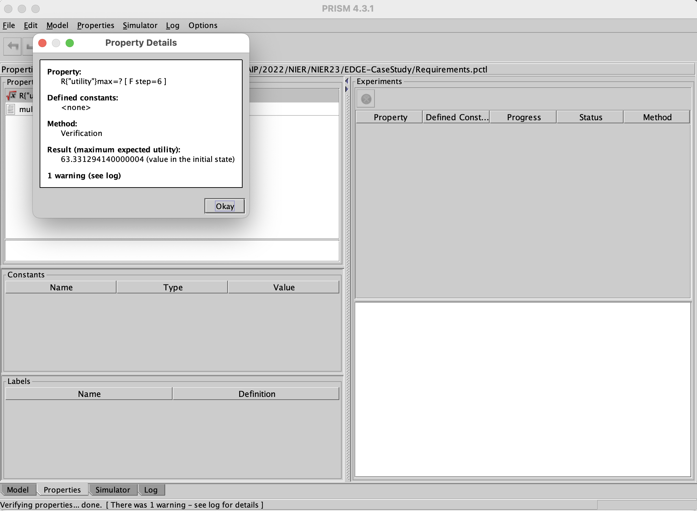
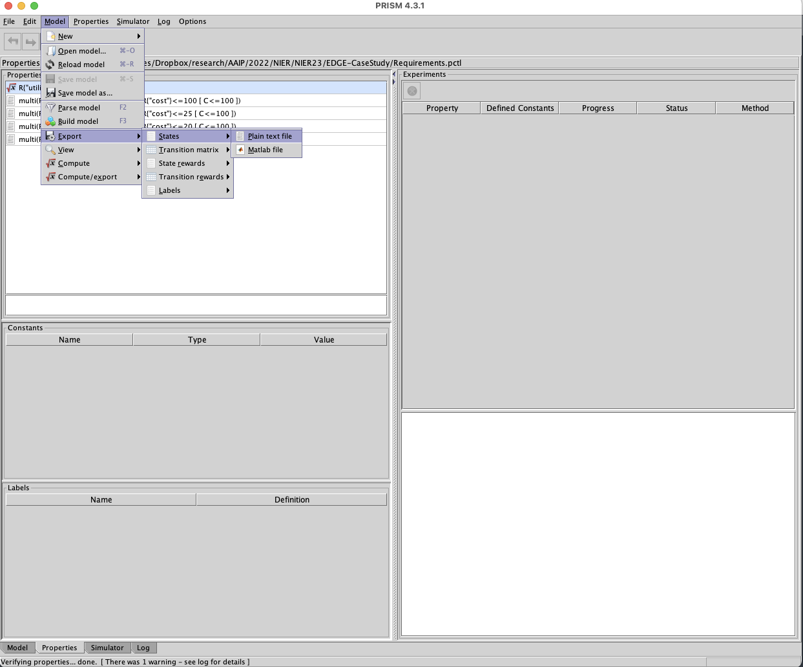

# EDGE - An ExtenDed Goal modElling paradigm for self-adaptive systems 

We propose EDGE, an ExtenDed Goal modElling paradigm for self-adaptive systems (SAS). The EDGE notation - shown below - provides support for the specification of goal variants, properties, status and dependencies, and allows the automated synthesis of goal controllers for the goal management layer of SAS.

We illustrate the use for the EDGE notation below, for a SAS comprising a robot whose top-level goal G0 is to maintain a patient room in a hospital by cleaning its floor in one of two ways (goal variants G1a, G1b, cf.~desideratum D1) and sterilizing the whole room/its bathroom (goal variants G6a, G6b). Cleaning the floor thoroughly (goal variant G1a) requires the moving of some of the room furniture to one side (goal G2), vacuum cleaning (goal variants (G3a), (G3b), wiping the floor (goal variants (G4a), (G4b), and replacing the removed furniture in its initial position (G5).

The Markov decision process derived by applying our method to the EDGE goal model for maintaining a patient's room is included in the [EDGE-CaseStudy folder](EDGE-CaseStudy). We used the probabilistic model checker PRISM to synthesise a goal controller (i.e., a policy for this MDP) which satisfies a requirement specified in the PRISM extension of probabilistic computational tree logic. Two examples of such requirements (each of which yields a different goal controller) are given below.

Requirement option 1: Maximise the SAS utility:

    R{"utility"}max=?[ F step=6 ]
    
(i.e., obtain the policy that maximises the expected MDP reward labelled "utility" cumulated until a state where step=6 is reached, where step=6 corresponds to each goal selected by the goal controller being either achieved, or attempted and found to be unachievable.)
         
Requirement option 2: Maximise the SAS utility subject to keeping the cost no larger than 25:

    multi(R{"utility"}max=?[ C<=100 ], R{"cost"}<=25 [ C<=100 ])
    
(i.e., obtain the policy that maximises the expected MDP reward labelled "utility" cumulated for MDP paths of 100 states, subject to the expected MDP reward labelled "cost" not exceeding 25 for MDP paths of the same lenght; we note that 100 states is a conservative overestimate of the number of MDP states that need to be traversed before each goal selected by the goal controller is either achieved, or attempted and found to be unachievable.).

These two probabilistic temporal logic formulae that can be supplied to PRISM in order to obtain two MDP policies are available [in the Requirements.pctl](EDGE-CaseStudy/Requirements.pctl) file, and the actual policy (in raw PRISM format) for the second requirement is available [in the GoalController.txt](EDGE-CaseStudy/GoalController.txt) file, along with the encoding that PRISM used for the MDP states, which we made available [in the MDPstates.txt](EDGE-CaseStudy/MDPstates.txt) file.

## INSTRUCTIONS TO SYNTHESIZE THE EDGE GOAL CONTROLLER
1. Install the probabilistic model checker PRISM (freely available [here](https://www.prismmodelchecker.org/download.php)) on your computer.

2. Start the PRISM GUI and load the [EDGE MDP model](EDGE-CaseStudy/EDGE_MDP.pm) into PRISM. Below a screenshot of the loaded file in PRISM:

3. Load the [PCTL-encoded property](EDGE-CaseStudy/Requirements.pctl) into PRISM.  Below a screenshot of the expect loaded properties file:

4. Configure PRISM to export the MDP policies it synthesises to a file by:    
    - Choosing Options in the Options menu.
    - In 'Adversary export' property, choose DTMC.
    - In 'Adversary export filename' property type the direct you want to have the synthesised MDP policies by PRISM.
    - Select 'Save Options'.
    

5. Go to the Properties tab, and right-click on the first property. Then select Verify. The expected outcome is depicted below.

6. Export the MDP states to a file. From the menu select: Model -> Export -> States and save it into a file name at your preference.

7. Extract the goal controller from the MDP policy synthesised by PRISM by setting up the failing configuration at stake. For example:

The system started with pursuing all first goal variants. However, the system failed while pursuing G3a. In the trace below, the tuple '1,1,1,1,1' means that all the first variants of the goal model (G2,G3a,G4a,G5,G6a, respectively) were pursued. However, when pursuing G3a (step=2), it failed (fail = true in the prior to last field below). 

    52931:(1,1,1,1,1,0,true,true,false,true,false,false,true,true,false,false,true,false,true,true,false,false,2,true,false)

The trace above is an excerpt of the [MDPstates.txt file](EDGE-CaseStudy/MDPstates.txt). 

Given the turn to the controller, it pursues another variant for G3, and skips G2 as it was already achieved as indicated by the first two fields in the tuple below (0,2,...). Notice that the controller is still with the turn (t=true) as it can be noticed from the last field of the tuple below. 

    41337:(0,2,1,1,1,2,true,true,false,true,false,false,true,true,false,false,true,false,true,true,false,false,0,false,true)

Then the full policy below is passed to the Change Management, where G2 is no longer pursued(G2_pursued=0 in the first field) as it has been already achieved:

    41187:(0,2,1,1,1,0,true,true,false,true,false,false,true,true,false,false,true,false,true,true,false,false,0,false,false)

