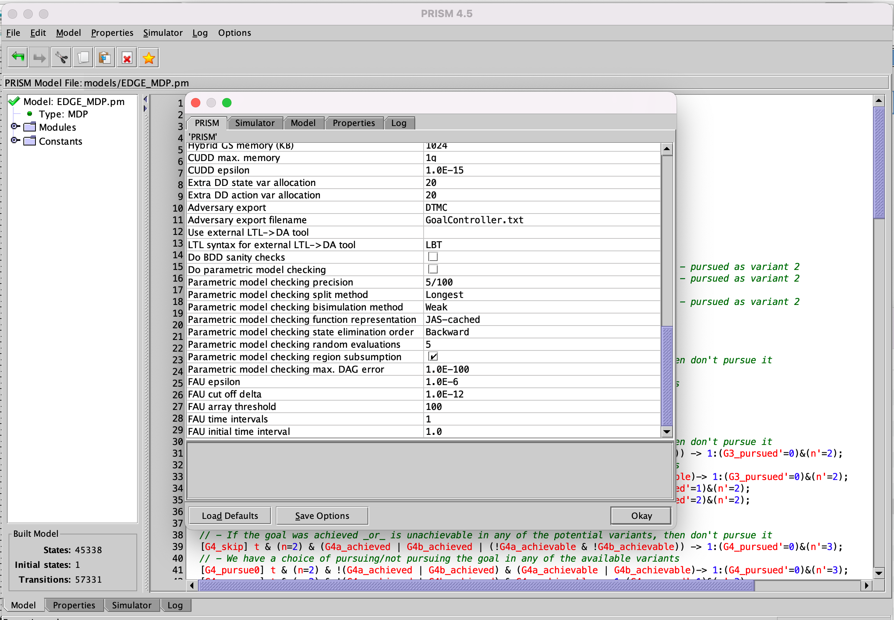

# EDGE - An ExtenDed Goal modElling paradigm for self-adaptive systems 

We propose EDGE, an ExtenDed Goal modElling paradigm for self-adaptive systems (SAS). The EDGE notation - shown below - provides support for the specification of goal variants, properties, status and dependencies, and allows the automated synthesis of goal controllers for the goal management layer of SAS.

We illustrate the use for the EDGE notation below, for a SAS comprising a robot whose top-level goal G0 is to maintain a patient room in a hospital by cleaning its floor in one of two ways (goal variants G1a, G1b, cf.~desideratum D1) and sterilizing the whole room/its bathroom (goal variants G6a, G6b). Cleaning the floor thoroughly (goal variant G1a) requires the moving of some of the room furniture to one side (goal G2), vacuum cleaning (goal variants (G3a), (G3b), wiping the floor (goal variants (G4a), (G4b), and replacing the removed furniture in its initial position (G5).

The Markov decision process derived by applying our method to the EDGE goal model for maintaining a patient's room is included in the [EDGE-CaseStudy folder](EDGE-CaseStudy). We used the probabilistic model checker PRISM to synthesise a goal controller (i.e., a policy for this MDP) which satisfies a requirement specified in the PRISM extension of probabilistic computational tree logic (PCTL). Two examples of such requirements (each of which yields a different goal controller) are given below.

Requirement option 1: Maximise the SAS utility:

    R{"utility"}max=?[ F step=6 ]
    
(i.e., obtain the policy that maximises the expected MDP reward labelled "utility" cumulated until a state where step=6 is reached, where step=6 corresponds to each goal selected by the goal controller being either achieved, or attempted and found to be unachievable.)
         
Requirement option 2: Maximise the SAS utility subject to keeping the cost no larger than 25:

    multi(R{"utility"}max=?[ C<=100 ], R{"cost"}<=25 [ C<=100 ])
    
(i.e., obtain the policy that maximises the expected MDP reward labelled "utility" cumulated for MDP paths of 100 states, subject to the expected MDP reward labelled "cost" no greater than 25 for MDP paths of the same lenght; we note that 100 states is a conservative overestimate of the number of MDP states that need to be traversed before each goal selected by the goal controller is either achieved, or attempted and found to be unachievable.).

These two probabilistic temporal logic formulae that can be supplied to PRISM in order to obtain different MDP policies are available [in the Requirements.pctl](EDGE-CaseStudy/Requirements.pctl) file, and the actual policy (in raw PRISM format) for the second requirement is available [in the GoalController.txt](EDGE-CaseStudy/GoalController.txt) file, along with the encoding that PRISM used for the MDP states, which we made available [in the MDPstates.txt](EDGE-CaseStudy/MDPstates.txt) file.

## INSTRUCTIONS TO SYNTHESIZE THE EDGE GOAL CONTROLLER
1. Install the probabilistic model checker PRISM (freely available [here](https://www.prismmodelchecker.org/download.php)) on your computer.

2. Start the PRISM GUI and load the [EDGE MDP model](EDGE-CaseStudy/EDGE_MDP.pm) into PRISM. Below, we provide a screenshot of the loaded file in PRISM:

3. Load the [PCTL-encoded requirements](EDGE-CaseStudy/Requirements.pctl) into PRISM.  Below, we provide a screenshot of our alternative requirements loaded into PRISM:

4. Configure PRISM to export the MDP policies it synthesises to a file by:    
    - Choosing Options in the Options menu.
    - In the 'Adversary export' property, choose DTMC.
    - In the 'Adversary export filename' property, type the name of the file to which PRISM will save the synthesised MDP policy (including the full path).
    - Select 'Save Options'.
    

5. Go to the Properties tab, and right-click on one of the alternative requirements. Then select Verify. The expected outcome (for the second requirement) is depicted below.

6. Export the MDP states to a file. From the menu select: Model -> Export -> States and save it into a file named at your preference, as shown below.

7. Use the MDP policy file and the MDP states file to determine the actions of the synthesised controller in different scenarios as explained below. We note that this somewhat tedious process can be easily automated.

To find out the goal variants that the controller decides to pursue in the initial state, observe at the top of the MDP state file that an MDP state is defined by the tuple:

    (G2_pursued,G3_pursued,G4_pursued,G5_pursued,G6_pursued,n,G2_achievable,G2_achieved,
    G3a_achievable,G3b_achievable,G3a_achieved,G3b_achieved,G4a_achievable,G4b_achievable,
    G4a_achieved,G4b_achieved,G5_achievable,G5_achieved,G6a_achievable,G6b_achievable,
    G6a_achieved,G6b_achieved,step,fail,t)
    
and notice from the MDP model that, in the initial MDP state, the value of this tuple is:

    (0,0,0,0,0,0,true,false,true,true,false,false,true,true,false,false,true,false,true,
    true,false,false,0,false,true)

A lookup for this tuple in the MDP states file yields

    1114:(0,0,0,0,0,0,true,false,true,true,false,false,true,true,false,false,true,false,true,true,false,false,0,false,true)
    
which indicates that the initial MDP state is the state with ID 1114.

Next, open the MDP policy file and search for this state ID; the search yields

    1114 34664 1
    
which indicates that the synthesised goal controller transitions from the initial state with ID 1114 to the state with ID 34664 with probability 1. Looking up state 34664 in the MDP policy file shows that the next transitions (i.e., the transition from state 34664) is to state 40824. Continue this process to extract all of the following transitions from the MDP policy file:

    1114 34664 1
    34664 40824 1
    40824 41845 1
    41845 42087 1
    42087 42239 1

and thus to determine that the controller path (i.e., sequence of states) 1114 -> 34664 -> 40824 -> 41845 -> 42087 -> 42239. Finally, return to the MDP states file to "decode" the what goal controller decisions these states correspond to:

    34664:(1,0,0,0,0,1,true,false,true,true,false,false,true,true,false,false,true,false,true,true,false,false,0,false,true)
    40824:(1,1,0,0,0,2,true,false,true,true,false,false,true,true,false,false,true,false,true,true,false,false,0,false,true)
    41845:(1,1,1,0,0,3,true,false,true,true,false,false,true,true,false,false,true,false,true,true,false,false,0,false,true)
    42087:(1,1,1,1,0,4,true,false,true,true,false,false,true,true,false,false,true,false,true,true,false,false,0,false,true)
    42239:(1,1,1,1,1,5,true,false,true,true,false,false,true,true,false,false,true,false,true,true,false,false,0,false,true)

The values of the first five elements of these tuples (correspondig to the MDP state variables G2_pursued, G3_pursued, G4_pursued, G5_pursued and G6_pursued, respectively) show that the initial goal variants that the goal controller selects for the system to pursue are G2, G3a, G4a, G5 and G6a.

For a second example, assume now that the system, under the control of the change management layer, successfully achieves goals G2 and G3a, but finds goal G4a no longer achievable. As a result, the change management layer must inform the goal management layer (i.e., the EDGE goal controller) about this situation, so that the goal controller can select a modified set of goal variants for the system to pursue. At the point where the goal controller is invoked again, the MDP state will correspond to the following tuple

    (1,1,1,1,1,0,true,true,true,true,true,false,false,true,false,false,true,false,true,true,false,false,0,false,true)
    
Notice the key differences from state 42239 above: the values for the elements G2_achieved, G3a_achieved and G4a_achievable are true, true and false, respectively. As before, a quick search through the MDP states file shows that this is state 42194, and another search through the MDP policy file shows that the goal controller takes the following sequence of transitions from state 42194:

    42194 25519 1
    25519 15606 1
    15606 20217 1
    20217 20237 1
    20237 20248 1
    
which correspond to the following entries from the MDP state file:

    25519:(0,1,1,1,1,1,true,true,true,true,true,false,false,true,false,false,true,false,true,true,false,false,0,false,true)
    15606:(0,0,1,1,1,2,true,true,true,true,true,false,false,true,false,false,true,false,true,true,false,false,0,false,true)
    20217:(0,0,2,1,1,3,true,true,true,true,true,false,false,true,false,false,true,false,true,true,false,false,0,false,true)
    20237:(0,0,2,1,1,4,true,true,true,true,true,false,false,true,false,false,true,false,true,true,false,false,0,false,true)
    20248:(0,0,2,1,1,5,true,true,true,true,true,false,false,true,false,false,true,false,true,true,false,false,0,false,true)
    
Thus, what the goal controller decides for this scenario is (see again the first five elements of the tuple, i.e., G2_pursued, G3_pursued, G4_pursued, G5_pursued and G6_pursued) that G2_pursued=G3_pursued=0 (since these two goals have already been achieved), G4_pursued=2 (i.e., the system should now pursue variant 2 of goal G4), G5_pursued=1 and G6_pursued=1. 

The two decisions of the goal controller -- i.e., the goal variants to be pursued initially, and the goal variants to be pursued after the successful completion of G2 and G3a, and G4a becoming unachievable) -- are also shown in our NIER paper and summarised in the diagram below.
